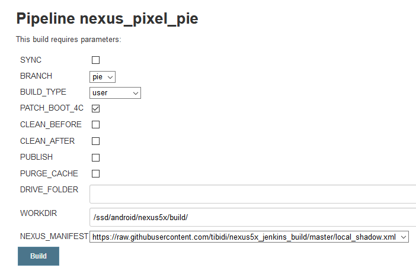

# nexus5x_jenkins_build
Jenkins pipeline for building nexus pixel 5x.

Links:
  - https://github.com/PixelExperience/manifest (PixelExperience repo)
  - https://github.com/BlissRoms/platform_manifest (How to build on Ubuntu)
  - https://github.com/USBhost/build-tools-gcc (Toolchain to build the kernel)
    - Compiled version here 10.x (use for flipflop) : 
      - https://drive.google.com/file/d/1kZlwfGhy3iOLkNHBsliwi2wBvY7QmN53
    - Compiled version here 8.3 (use for shadow) : 
      - https://drive.google.com/file/d/1Re5NmxT-tOOmBuM1LLbFQ3O0TPFEA6GA
  - https://github.com/pawitp/nexus-5x-blod-fix (The python script to fix BLOD)
  - the local.xml contains nexus 5x specific repos
  - the local_flipflop.xml contains my fork nexus 5x specific repos (flipflop kernel)
  - the local_shadow.xml contains my fork nexus 5x specific repos (shadow kernel)
  
  The Jenkins pipeline parameters:
  

 
